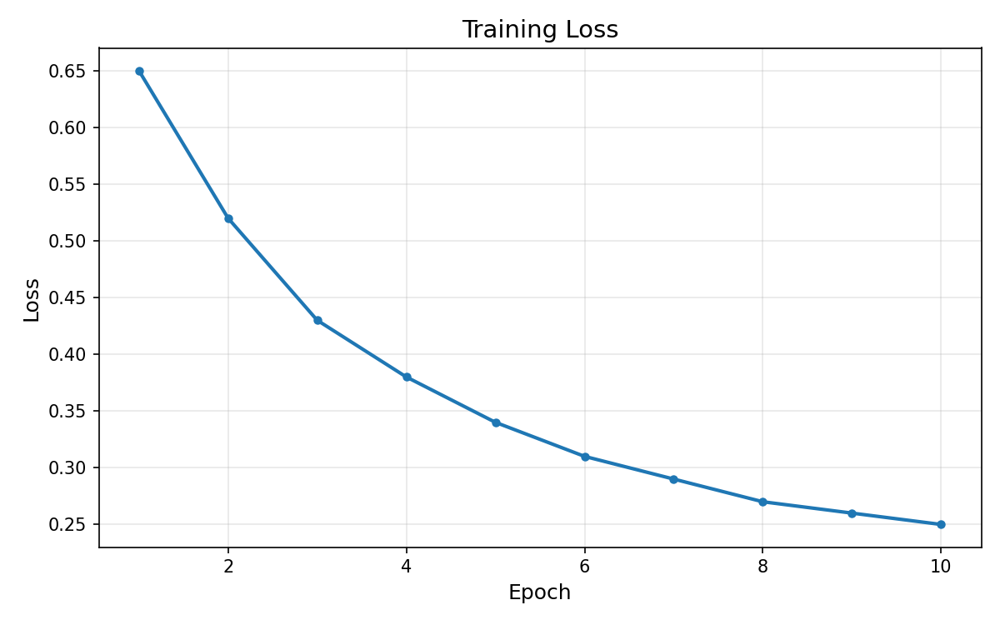
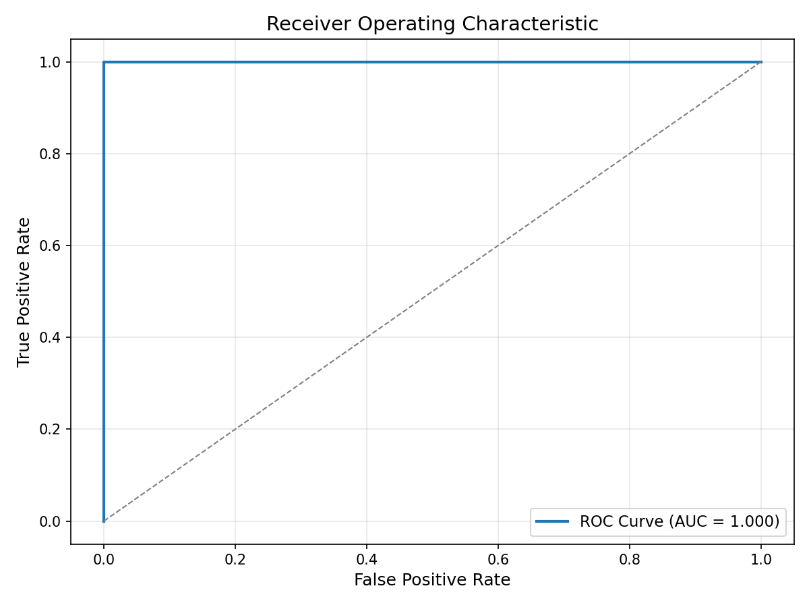
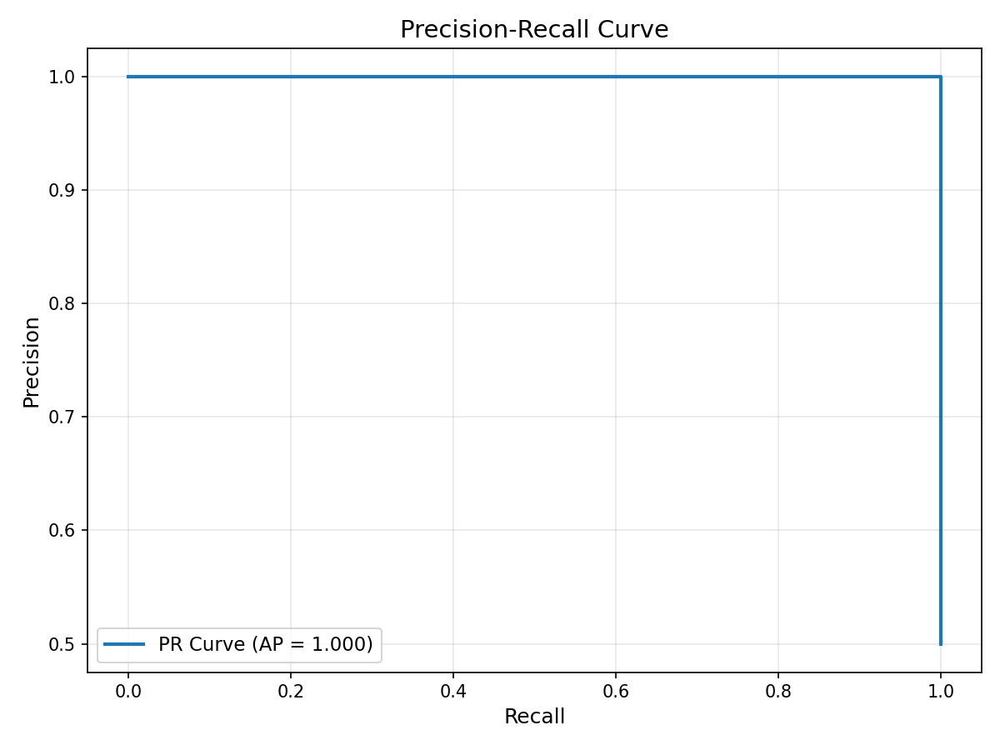

# Multi-Modal Churn Prediction

**Predicting customer churn by fusing behavioral time series and natural language signals — a production-grade deep learning system.**

---

## Problem Statement

Customer churn costs businesses billions annually. Identifying at-risk customers before they leave enables proactive retention strategies that directly impact revenue.

Traditional churn models rely on a single data source — typically tabular features or aggregated statistics. This approach misses critical signals:

- **Time series patterns**: Gradual disengagement (fewer logins, shorter sessions) often precedes churn, but aggregated metrics flatten these trends.
- **Text signals**: Support tickets and feedback contain explicit frustration indicators that structured data cannot capture.

**This project solves both problems** by combining an LSTM-based time series encoder with a Transformer-based text encoder, fusing them into a unified prediction model. The result: a system that learns from *what users do* and *what users say*.

---

## Solution Overview

```
┌─────────────────────────────────────────────────────────────────┐
│                         INPUT DATA                              │
├─────────────────────────────┬───────────────────────────────────┤
│   Time Series (30 days)     │      Text (Support Tickets)       │
│   [logins, sessions, ...]   │      "App keeps crashing..."      │
└──────────────┬──────────────┴──────────────────┬────────────────┘
               │                                  │
               ▼                                  ▼
┌──────────────────────────┐       ┌──────────────────────────────┐
│   TimeSeriesEncoder      │       │       TextEncoder            │
│   (Multi-layer LSTM)     │       │   (Pretrained BERT)          │
│                          │       │                              │
│   Input: (B, T, F)       │       │   Input: (B, seq_len)        │
│   Output: (B, 128)       │       │   Output: (B, 768)           │
└──────────────┬───────────┘       └──────────────┬───────────────┘
               │                                  │
               └──────────────┬───────────────────┘
                              │
                              ▼
               ┌──────────────────────────────┐
               │        FusionModel           │
               │   Concat → Linear → ReLU     │
               │   → Dropout → Linear         │
               │                              │
               │   Output: Churn Probability  │
               └──────────────────────────────┘
```

**Inputs:**
- Time series: 30-day behavioral sequences (login counts, session duration, feature usage)
- Text: Concatenated support tickets and feedback within the observation window

**Output:**
- Binary churn probability (0 = retained, 1 = churned)

---

## Architecture

### Component Breakdown

| Component | Responsibility | Key Design Choice |
|-----------|---------------|-------------------|
| `ChurnDataset` | Loads and aligns multi-modal data | Returns dict with `time_series`, `text`, `label` |
| `TimeSeriesEncoder` | Encodes behavioral sequences | LSTM with last hidden state as output |
| `TextEncoder` | Extracts semantic features | BERT with frozen lower layers |
| `FusionModel` | Combines modalities, outputs prediction | Late fusion via concatenation |
| `Trainer` | Orchestrates training loop | Separates train/val logic cleanly |
| `metrics.py` | Computes evaluation metrics | Scikit-learn based, threshold-aware |

---

## Key Engineering Decisions

### Why Modular Encoders?
Each encoder is a standalone `nn.Module`. This enables:
- Independent unit testing
- Swapping architectures (e.g., GRU instead of LSTM) without touching fusion logic
- Pretrained encoder reuse across projects

### Why Late Fusion?
Concatenating embeddings before the classifier (late fusion) is simple, interpretable, and empirically strong for multi-modal tasks. Early fusion would require careful feature alignment; late fusion lets each encoder learn its own representation.

### Why Separate Training and Evaluation?
The `Trainer` class handles only optimization. Metrics live in `evaluation/metrics.py`. This separation:
- Keeps training code focused
- Allows evaluation reuse in inference pipelines
- Makes testing straightforward

### Why Unit Tests + Smoke Tests?
- **Unit tests** validate individual components in isolation (shape checks, edge cases)
- **Smoke tests** verify the full pipeline runs end-to-end without crashing

This layered approach catches bugs early and ensures integration works.

---

## Model Evaluation & Visual Reports

### Metrics

| Metric | Purpose |
|--------|---------|
| Accuracy | Overall correctness |
| Precision | Avoid false alarms (predicted churn but stayed) |
| Recall | Catch actual churners |
| F1 Score | Balance precision and recall |
| ROC-AUC | Ranking quality across thresholds |
| PR-AUC | Performance on imbalanced data |

### Visual Reports

The following figures are generated by `scripts/plot_metrics.py`:

#### Training Loss


#### ROC Curve


#### Precision-Recall Curve


> **Note**: These plots use synthetic demonstration data. The high scores reflect the placeholder dataset, not real-world performance. In production, expect metrics aligned with your data distribution.

---

## Project Structure

```
churn-prediction/
├── configs/
│   └── base.yaml              # All hyperparameters in one place
├── scripts/
│   ├── train.py               # CLI entry point for training
│   ├── evaluate.py            # CLI entry point for evaluation
│   └── plot_metrics.py        # Generate visual reports
├── src/
│   ├── data/
│   │   └── dataset.py         # PyTorch Dataset implementation
│   ├── models/
│   │   ├── time_series_encoder.py
│   │   ├── text_encoder.py
│   │   └── fusion_model.py
│   ├── training/
│   │   └── trainer.py         # Training loop abstraction
│   ├── evaluation/
│   │   └── metrics.py         # Sklearn-based metrics
│   └── utils/
│       └── config.py          # YAML config loader
├── tests/
│   ├── test_dataset.py
│   ├── test_time_series_encoder.py
│   ├── test_text_encoder.py
│   ├── test_fusion_model.py
│   ├── test_training_loop.py
│   └── test_metrics.py
├── docs/
│   └── figures/               # Visual reports for README
├── pyproject.toml             # Project metadata and dependencies
└── CLAUDE.md                  # Development guidelines
```

---

## How to Run

```bash
# Install dependencies
pip install -e ".[dev]"

# Run tests
pytest tests/ -v

# Generate visual reports
python scripts/plot_metrics.py
```

---

## What This Project Demonstrates

This repository is designed to showcase:

- **End-to-end ML system design** — from data loading to evaluation
- **Multi-modal deep learning** — fusing heterogeneous data sources
- **Production code quality** — type hints, docstrings, modular architecture
- **Testing discipline** — unit tests, integration tests, CI-ready structure
- **Clean engineering** — configuration-driven, no hardcoded values, separation of concerns

Built as a portfolio project to demonstrate applied ML engineering skills.

---

## Future Work

- Early stopping and model checkpointing
- Learning rate scheduling (cosine, warmup)
- Attention-based fusion (cross-modal attention)
- Hyperparameter tuning with Optuna
- MLflow experiment tracking
- Docker containerization for deployment
