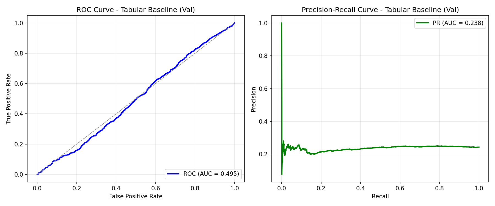
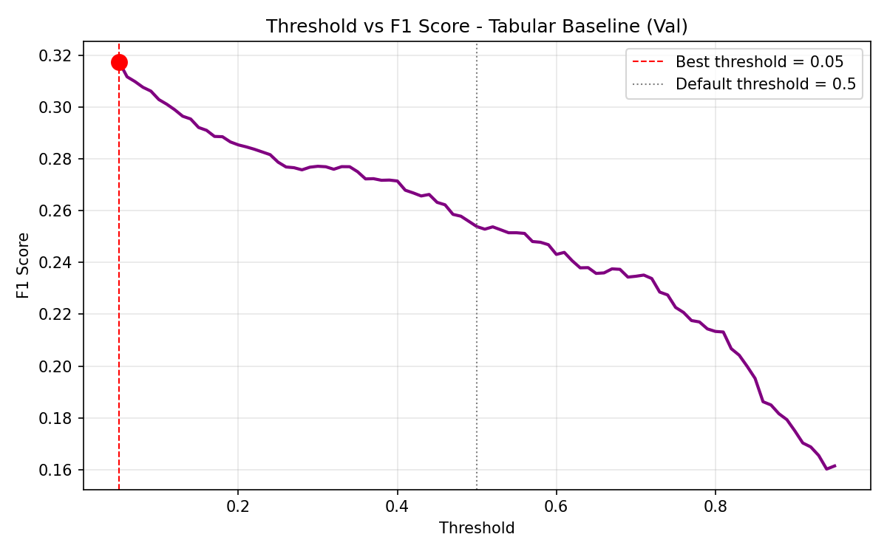

# Churn Prediction with Large-Scale Behavioral Time Series

**A production-oriented churn prediction system built on large-scale user behavior logs, focusing on memory-efficient data processing, temporal modeling, and honest model evaluation.**

---

## Problem Statement

Customer churn prediction aims to identify users who are likely to stop using a service in the near future. Early identification of at-risk users enables proactive retention strategies and has direct business impact.

Many churn models rely solely on aggregated tabular features. While simple and efficient, this approach often misses **temporal disengagement patterns**, such as gradual decreases in activity or sudden drops in usage — signals that are especially important in subscription-based products.

This project investigates:

- Whether simple aggregated (tabular) features are sufficient for churn prediction  
- Whether **temporal modeling with time series data** provides meaningful gains  
- How evaluation choices (splitting, metrics, thresholds) affect conclusions under heavy class imbalance  

---

## Solution Overview

The system is designed as an **end-to-end churn prediction pipeline**, covering data ingestion, preprocessing, model training, evaluation, and visualization.

Two modeling approaches are compared:

1. **Tabular Baseline**
   - Aggregated statistics over a 30-day observation window
   - Simple, interpretable reference model

2. **Time-Series-Only Model (LSTM)**
   - Sequential modeling of daily user behavior
   - Captures temporal dynamics lost in aggregation

The codebase also contains architecture-ready components for text modeling and multi-modal fusion. However, **no text data is available in the KKBOX dataset**, so these models are not evaluated in this iteration.

---

## Model Variants

| Model | Input Representation | Uses Text | Purpose |
|------|----------------------|-----------|---------|
| Tabular Baseline | Aggregated (7 features) | No | Performance floor |
| Time-Series-Only | Sequential (30 × 6) | No | Measure temporal signal |
| Fusion Model | Sequential + Text | Yes (future) | Architecture-ready |

---

## Dataset

- **Source**: KKBOX music streaming service  
- **Raw size**: ~30GB  
- **Rows**: ~392 million user activity logs  
- **Labels**: Binary churn indicator per user  
- **Observation window**: Last 30 days of activity  
- **Split strategy**: Time-based (no random sampling)  

Time-based splitting is critical to prevent **data leakage**, as training on future behavior to predict past churn would invalidate results.

---

## Engineering Challenges

### Memory-Efficient Data Processing

The dataset is too large to load into memory at once. A naive `pd.read_csv()` approach is infeasible.

**Solution: Two-pass chunked processing**
- **Pass 1**: Compute per-user metadata (window boundaries, activity span)
- **Pass 2**: Collect windowed logs for each user

This design trades runtime for memory safety and enables large-scale local experimentation on commodity hardware.

---

### Caching Strategy

Processed datasets are cached to disk as PyTorch tensors to avoid reprocessing the 30GB CSV on every run.

A key lesson learned:

> Cache keys must encode **all parameters that affect data shape or semantics**.

Early cache designs caused shape mismatches when switching between aggregated and sequential representations, highlighting a common pitfall in ML pipelines.

---

## Evaluation Setup

- **Evaluation split**: Validation set only (time-based)
- **Primary metric**: ROC-AUC (ranking ability)
- **Secondary metrics**: PR-AUC, F1 score
- **Loss**: Binary Cross-Entropy with logits
- **Threshold tuning**: Explicitly performed due to class imbalance

Accuracy and F1 at default thresholds are misleading in churn prediction, where the positive class is rare.

---

## Results & Comparison

### Model Performance (Validation Set)

| Model | ROC-AUC | PR-AUC | F1 (t=0.5) | F1 (optimized) |
|------|--------|--------|------------|----------------|
| Tabular Baseline | 0.495 | 0.238 | 0.254 | 0.317* |
| Time-Series-Only (LSTM) | ~0.60 | ~0.31 | ~0.00 | ~0.41** |

\* Tabular Baseline optimized at threshold = 0.05  
\*\* Time-Series-Only optimized at threshold ≈ 0.25  

---

### Validation Curves (Tabular Baseline)


*ROC and Precision–Recall curves on the validation set for the tabular baseline model.*


*F1 score as a function of the decision threshold. The optimal threshold is selected to maximize F1 under class imbalance.*

---

## Key Observations

1. **Class imbalance dominates evaluation**  
   Threshold-independent metrics (ROC-AUC, PR-AUC) are more informative than accuracy or F1@0.5.

2. **Temporal modeling matters**  
   Sequential models capture disengagement patterns that aggregated features cannot.

3. **Churn is a ranking problem**  
   The practical value lies in ordering users by risk, not binary decisions at arbitrary thresholds.

4. **Engineering choices shape outcomes**  
   Data splitting, caching, and preprocessing decisions materially affect conclusions.

---

## Project Structure

```
churn-prediction/
├── README.md
├── pyproject.toml
├── CLAUDE.md
├── configs/
│   └── base.yaml
├── data/
│   ├── raw/
│   └── cache/
├── artifacts/
│   ├── checkpoints/
│   └── figures/
├── figures/
│   ├── tabular_roc_pr_val.png
│   └── tabular_threshold_f1_val.png
├── scripts/
│   ├── train.py
│   ├── evaluate.py
│   ├── evaluate_tabular_and_plot.py
│   └── plot_metrics.py
├── src/
│   ├── data/
│   ├── models/
│   ├── training/
│   ├── evaluation/
│   └── utils/
└── tests/
```

---

## What This Project Demonstrates

- End-to-end ML system design on large-scale data  
- Memory-safe processing of 30GB datasets  
- Temporal modeling with LSTM networks  
- Honest evaluation under class imbalance  
- Production-quality, modular ML code  

Built as a portfolio project to demonstrate applied machine learning engineering skills.
